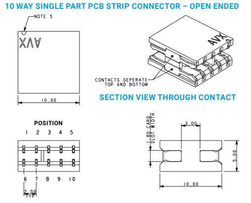

# edgy_boards
Decompose electronic circuits into testable, shareable and reusable basic blocks. That is, in essence, what this project is about. Software has library code from which one can easily import generic code written by others, this is an attempt at providing that but for circuits. Drasticly reduced cost of PCB manufacturing over the last decade as well as a proper open source EDA toolchain with higherarchical sheet support ([KiCad](https://www.kicad.org/)) have led us to rethink how the electronic circuit design workflow should be organized. The goal is to allow reuse of as many parts of the design as possible such that only the novel pieces require effort.

## motivating example

example of a possible composition of single edgy_boards to form a PoE and ethernet capable sensor circuit including a PI4 used to debug it.

example of an rp2040 to edge connector breakout board [b018](https://github.com/skunkforce/b018_pi_pico_breakout).  

card edge connector used to connect edgy boards together. 

## leveraging submodule in hardware design
Most hardware consists of basic blocks of functionality that have been used before by the same engineer or company. However, in the current state of the art, we still rely on copy-pasting schematic pieces with none of the advantages that libraries and submodules bring. If a hardware bug is discovered, it is usually not trivially traceable which circuits within a company's portfolio are impacted for example. Since edgy boards are organized as a top-level sheet with connectors and edgy related things and a subsheet with the actual circuit it is possible to add the design as a submodule and use the subsheet directly in a larger design.

## scope of this repository
This repository contains the deign requirements which an edgy board must fulfill to be part of this project as well as organized list of repositories where edgy boards can be found. The set of defined interfaces with which edgy boards can be connected together can be found [here](https://github.com/skunkforce/put_on_edge).

# Contributing
## workflow
1. make a new repository from the template repository [edgy_board_template](https://github.com/skunkforce/edgy_board_template) either in this organization (if you are a member) or in your own github. Repos in this organization should follow the naming scheme b081_short-description_partnr, there are no naming requirements for external repos. 
2. make a pull request to this repo with your board name, description and link added to the in_progress.md with status "initial".
3. develope, test and order your board. Make a tag in your dev branch containing the revision number on your board. This should trigger CI to make you all the outputs you need.
4. make sure you fulfill the quality checklist
5. test your board documenting both the tests as well as the results and any useful code etc. needed to reproduce these tests in TEST.md. If your tests fail go to step 3.
6. make a pull request to this repository with the release version number as well as a link to your TEST.md containing a description of tests.

## quality checklist
1. schemetic is organized such that only the edgy connectors and possible decoupling caps, jumpers etc. are in the toplevel sheet and everything that could be reused is in its own subsheet (potentially with more subsheets). This will help your users only include the subsheet when composing edgys for a larger design.
The schemetic in the template repository has a subsheet named implementation.kicad_sch, please rename this to something more descriptive and something that will not clash with other implementation sheets in other edgies. 
2. put_on_edge is included as a submodule and referenced locally
3. All symbols, footprints and 3d models not provided by the default installation of KiCad are contained and referenced in the repository in a library named the same as the board (e.g. osf.b013.pretty and osf.b013.kicad_lib). All paths in symbol and footprint libraries are relative paths. This will prevent clashes when composing multiple boards using submodules.
4. Boards should be made up of 16mm high x 24mm wide units subtracting 3mm space for the connectors. this means that a board which is 2 units wide and 4 units high would be 2 x 24mm = 48mm - 3mm = 45mm wide and 4 x 16mm = 64mm - 3mm = 61mm high. Most boards are 1 unit in size or 13mm x 21mm. With and height being multiples of the 8mm bump spacing of legos was intentional. 
5. the kicad style follows our style guide
6. a TEST.md describing what tests were carried out and their results as well as a README.md which contains a picture and a description.
7. a 3d model is availible in .stp format
8. it is strongly recommended that the board contain an MIT licence file. If this is not possible it should be clearly noted in the list contained the the README.md of this repo.
9. optional but recommended, the board contains the open hardware logo on the silkscreen

## edgy composition workflow
1. add all edgys used in th e composition as submodules
2. add all the symbol libraries from the respective submodules to the composition project via relative paths.
3. copy the relevant subsheet files (.kicad_sch) from the submodules to the composisitons project folder.
4. open each toplevel sheet from each submodule, copy the subsheet from within the schemetic editor and past it into the composition schemetic. Since you copied the subsheet files in step 3 KiCad should automaticly find the correct files and link them.

# Edgy Boards

[completed and tested edgy boards](Tested.md)

[in progress edgy boards](in_progress.md)
